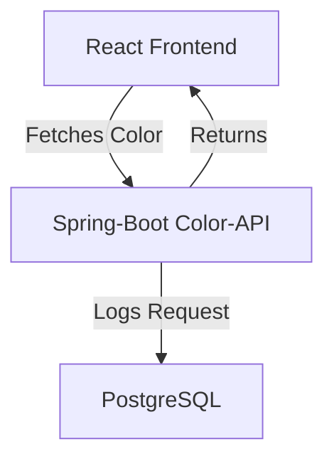

# Kubernetes for Developers Workshop

This workshop is intended for developers who want to learn how to deploy applications to Kubernetes.

## Prerequisites
- Install Homebrew (https://brew.sh/)
- Docker or Podman
- Minikube (https://minikube.sigs.k8s.io/docs/start/)
- kubectl (https://kubernetes.io/docs/tasks/tools/install-kubectl-linux/#install-kubectl-binary-with-curl-on-linux)
- Helm (https://helm.sh/docs/intro/install/)

## Follow the workshop


### Color-Application Architecture Overview




### 1. Understanding Containers (just fancy tar archives)

1. Have a look at the example spring boot application in the [color-api](color-api) directory. It is super exiting since it provides an endpoint which returns a random hex color.

2. Have a look at the [Dockerfile](color-api/Dockerfile)
3. Build the Container-File with the following command:
```bash
docker build -t spring-boot-demo:latest color-api
```

4. Lets inspect the image - actually it is a fancy called tar archive:
```bash
docker save spring-boot-demo:latest -o spring-boot-demo.tar
```

5. Run the `inspect_layers.sh` shell script
   - It extracts the tar archive into the [extracted_image](extracted_image) folder
   - It extracts each layer tar archive in the [extracted_image/blobs](extracted_image/blobs) folder into the [layers](layers) folder
   - It merges the layers into a single file system in the [merged_layers](merged_layers) folder - it just copies all files and says "replace" when there is a conflict (the script does have a look at the order which is defined in [extracted_image/manifest.json](extracted_image/manifest.json))

6. Have a look at the [merged_layers](merged_layers) folder - it is the file system of the container image

#### Understanding Multi-Stage Builds (optional)

7. Modify the docker file and follow the instructions inside the comment. This makes it a multi-stage build. Lets build again and inspect the image again.

### 2. Build and run the frontend application container

1. Have a look at the example next.js application in the [nextjs-frontend](nextjs-frontend) directory. It just fetches the randomly generated color from the color-api and displays it.

2. Build and run the container

```bash
docker build -t nextjs-frontend:latest nextjs-frontend
docker run -p 3000:3000 nextjs-frontend:latest
```

3. Open [http://localhost:3000](http://localhost:3000) in your browser


### 2. Connecting the containers using a docker-compose.yaml

1. Have a look at the [docker-compose.yaml](docker-compose.yaml) file
2. It adds a postgresql to the deployment
3. It configures the COLOR_API_URL environment variable
4. Run the following command to **build and start** the containers. Use the image references from github to avoid building the images yourself.

```bash
docker compose up
```

5. Open [http://localhost:3000](http://localhost:3000) in your browser - now it should return a color from the color-api


### 3. Installing and starting Minikube

https://minikube.sigs.k8s.io/docs/start/

```bash
brew install minikube && minikube start
```

Enable the storage provisioner and ingress controller

```bash
minikube addons enable storage-provisioner
minikube addons enable ingress
```

### 3. Create the namespace "workshop" inside the minikube cluster

```bash
minikube kubectl create namespace workshop
```

If this command fails - install `kubectl` by following this documentation: https://kubernetes.io/docs/tasks/tools/install-kubectl-linux/#install-kubectl-binary-with-curl-on-linux

### 3. PostgreSQL-Installation using Helm

```bash
helm repo add bitnami https://charts.bitnami.com/bitnami
```

```bash
helm install -n workshop postgresql bitnami/postgresql
```

Inspect the running deployment - was the startup successful?

```bash
kubectl get pods -n workshop

NAME                        READY   STATUS    RESTARTS       AGE
postgresql-0                1/1     Running   1 (2m5s ago)   15m
```


### 4. Creating Kubernetes Deployment files

- Deploy the COLOR-API

    The nextjs-frontend is already done for you as an example. Go ahead and create the `color-api` deployment files.

    Apply it to the cluster using the following command:

    ```bash
    kubectl apply -n workshop -f kube/color-api
    ```

    Hints:

    - We need a deployment and a service
    - You can use the publicly available image `ghcr.io/l3montree-dev/kubernetes-developer-workshop/color-api:latest`
    - The application starts at port 8080
    - The application needs the following environment variables:
        - `DB_URL`: jdbc:postgresql://postgresql:5432/postgres
        - `DB_USER`: postgres
        - `DB_PASS`: ? (hint: check the secret)


- Configure the connection between the frontend and the color-api (COLOR_API_URL environment variable)

### 5. Deploy the whole application - kubernetes is idempotent

```bash
kubectl apply -n workshop -R -f kube
```

Have a look at the running pods

```bash
kubectl get pods -n workshop

NAME                         READY   STATUS    RESTARTS      AGE
color-api-5c8bc7f9d6-2t7df   1/1     Running   0             23m
color-api-5c8bc7f9d6-72qnw   1/1     Running   0             23m
frontend-68bcf87ffd-n7wtp    1/1     Running   0             39m
postgresql-0                 1/1     Running   1 (49m ago)   63m
```

Use minikube to view the frontend

```bash
minikube tunnel
```

The frontend should be available at [http://127.0.0.1](http://127.0.0.1).

### 6. Create a Helm-Chart for the color-api

```bash
helm create color-application
```

Run the following command to remove everything except the Chart.yaml and values.yaml

```bash
rm -rf color-application/templates/* color-application/charts
```

Run the following command to clear the values.yaml file

```bash
echo "" > color-application/values.yaml
```

Now we can start with a fresh helm chart.

1. Copy the contents of the kube folder inside the templates folder of the helm chart
   ```bash
    cp -r kube/* color-application/templates/
    ```

2. Modify the color-application/nextjs-frontend/ingress.yaml file path prefix. Call it `/helm`. Since we already have an ingress defined

3. Thats it. We created a helm chart. Install it using helm

   ```bash
    helm upgrade --install -n workshop-helm --create-namespace color-application color-application
    ```

4. Have a look at the running pods. Notice the different namespace `workshop-helm`

    ```bash
    kubectl get pods -n workshop-helm

    NAME                         READY   STATUS                       RESTARTS   AGE
    color-api-564cf76456-nchc7   0/1     CreateContainerConfigError   0          9m56s
    color-api-564cf76456-w2dkr   0/1     CreateContainerConfigError   0          9m56s
    frontend-68bcf87ffd-6pkz9    1/1     Running                      0          9m56s
    ```
    
    The color-api pods are not able to start. We are missing the database we installed with helm in the `workshop` namespace. We need to create a dependency between the color-api and the postgresql helm-chart.

5. Add the postgresql dependency to the `Chart.yaml`

    ```yaml
    dependencies:
      - name: postgresql
        version: 16.4.9
        repository: https://charts.bitnami.com/bitnami
    ```

    Now try to install the helm chart again

    ```bash
    helm upgrade --install -n workshop-helm --create-namespace color-application color-application
    ```

    It fails. We need to install the dependencies first.

6. Install the dependencies

    ```bash
    helm dependency update color-application
    ```

    Apply the helm chart again

    ```bash
    helm upgrade --install -n workshop-helm --create-namespace color-application color-application
    ```

    Have a look at the running pods.

    ```bash
    kubectl get pods -n workshop-helm

    NAME                             READY   STATUS                       RESTARTS   AGE
    color-api-564cf76456-khh2s       0/1     CreateContainerConfigError   0          52s
    color-api-564cf76456-w2dkr       0/1     CreateContainerConfigError   0          16m
    color-application-postgresql-0   1/1     Running                      0          108s
    frontend-68bcf87ffd-6pkz9        1/1     Running                      0          16m
    ```

    We were able to install the postgresql dependency. The color-api pods are still not able to start. We need to configure the environment variables.

7. Correct the deployment of the color-api

    The color-api needs the postgresql password again. Maybe we can use a secretKeyRef environment variable.

    ```yaml
    env:
      - name: DB_PASS
        valueFrom:
          secretKeyRef:
            name: color-application-postgresql
            key: postgres-password
    ```

    Check if the DB_URL is correctly configured. You can find the created service name with the following command:

    ```bash
    kubectl get services -n workshop-helm
    ```

    Apply the helm chart again

    ```bash
    helm upgrade --install -n workshop-helm --create-namespace color-application color-application
    ```

8. Check the running pods and visit the frontend

9. Use Helm Values to configure the amount of color-api replicas

    ```yaml
    # values.yaml
    replicaCount: 2
    ```

    Use the `replicaCount` value in the [color-application/color-api/deployment.yaml](color-application/color-api/deployment.yaml)

    ```yaml
    spec:
      replicas: {{ .Values.replicaCount }}
    ```

    Apply the helm chart again

    ```bash
    helm upgrade --install -n workshop-helm --create-namespace color-application color-application
    ```

    Check the running pods

    ```bash
    kubectl get pods -n workshop-helm

    NAME                             READY   STATUS    RESTARTS   AGE
    color-api-86f8b7bb7d-29mt7       1/1     Running   0          8m48s
    color-api-86f8b7bb7d-2lzql       1/1     Running   0          8m46s
    color-api-86f8b7bb7d-rl78x       1/1     Running   0          15s
    color-application-postgresql-0   1/1     Running   0          10m
    frontend-68bcf87ffd-vvv5v        1/1     Running   0          10m
    ```

    Visit the frontend - now we should see 3 different colors after reloading a few times.

10. Thats it - we have created a small basic helm chart. Lets package it

    ```bash
    helm package color-application
    ```

    You can find the packaged helm chart in the `color-application-0.1.0.tgz` file.

    You can install the packaged helm chart using the following command. Notice the `--set` flag to configure the amount of replicas. Since we made it configurable in the values.yaml file, we can use it here.

    ```bash
    helm install -n workshop-helm-packaged --create-namespace color-application color-application-0.1.0.tgz --set replicaCount=1


    Error: INSTALLATION FAILED: 1 error occurred:
        * admission webhook "validate.nginx.ingress.kubernetes.io" denied the request: host "_" and path "/helm" is already defined in ingress workshop-helm/frontend-ingress
    ```

    The installation fails, since we cannot again define the same path in the ingress. Maybe we can make that configurable as well?


## Building and publishing the Docker-Images

```bash
docker buildx build --push --platform linux/arm64/v8,linux/amd64 -t ghcr.io/l3montree-dev/kubernetes-developer-workshop/nextjs-frontend:latest nextjs-frontend
```


```bash
docker buildx build --push --platform linux/arm64/v8,linux/amd64 -t ghcr.io/l3montree-dev/kubernetes-developer-workshop/color-api:latest color-api
```
