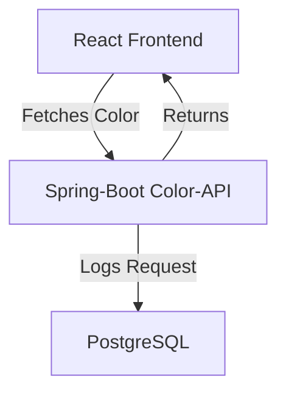

# Kubernetes for Developers Workshop

This workshop is intended for developers who want to learn how to deploy applications to Kubernetes.

## Prerequisites
- Install Homebrew (https://brew.sh/)
- Docker or Podman
- Minikube (https://minikube.sigs.k8s.io/docs/start/)
- kubectl (https://kubernetes.io/docs/tasks/tools/install-kubectl-linux/#install-kubectl-binary-with-curl-on-linux)
- Helm (https://helm.sh/docs/intro/install/)

## Follow the workshop


### Color-Application Architecture Overview




### 1. Understanding Containers (just fancy tar archives)

1. Have a look at the example spring boot application in the [color-api](color-api) directory. It is super exiting since it provides an endpoint which returns a random hex color.

2. Have a look at the [Dockerfile](color-api/Dockerfile)
3. Build the Container-File with the following command:
```bash
docker build -t spring-boot-demo:latest color-api
```

4. Lets inspect the image - actually it is a fancy called tar archive:
```bash
docker save spring-boot-demo:latest -o spring-boot-demo.tar
```

5. Run the `inspect_layers.sh` shell script
   - It extracts the tar archive into the [extracted_image](extracted_image) folder
   - It extracts each layer tar archive in the [extracted_image/blobs](extracted_image/blobs) folder into the [layers](layers) folder
   - It merges the layers into a single file system in the [merged_layers](merged_layers) folder - it just copies all files and says "replace" when there is a conflict (the script does have a look at the order which is defined in [extracted_image/manifest.json](extracted_image/manifest.json))

6. Have a look at the [merged_layers](merged_layers) folder - it is the file system of the container image

#### Understanding Multi-Stage Builds (optional)

7. Modify the docker file and follow the instructions inside the comment. This makes it a multi-stage build. Lets build again and inspect the image again.

### 2. Build and run the frontend application container

1. Have a look at the example next.js application in the [nextjs-frontend](nextjs-frontend) directory. It just fetches the randomly generated color from the color-api and displays it.

2. Build and run the container

```bash
docker build -t nextjs-frontend:latest nextjs-frontend
docker run -p 3000:3000 nextjs-frontend:latest
```

3. Open [http://localhost:3000](http://localhost:3000) in your browser


### 2. Connecting the containers using a docker-compose.yaml

1. Have a look at the [docker-compose.yaml](docker-compose.yaml) file
2. It adds a postgresql to the deployment
3. It configures the COLOR_API_URL environment variable
4. Run the following command to **build and start** the containers. Use the image references from github to avoid building the images yourself.

```bash
docker compose up
```

5. Open [http://localhost:3000](http://localhost:3000) in your browser - now it should return a color from the color-api


### 3. Installing and starting Minikube

https://minikube.sigs.k8s.io/docs/start/

```bash
brew install minikube && minikube start
```

Enable the storage provisioner

```bash
minikube addons enable storage-provisioner
```

### 3. Create the namespace "workshop" inside the minikube cluster

```bash
minikube kubectl create namespace workshop
```

If this command fails - install `kubectl` by following this documentation: https://kubernetes.io/docs/tasks/tools/install-kubectl-linux/#install-kubectl-binary-with-curl-on-linux

### 3. PostgreSQL-Installation using Helm

```bash
helm repo add bitnami https://charts.bitnami.com/bitnami
```

```bash
helm install -n workshop postgresql bitnami/postgresql
```

Inspect the running deployment - was the startup successful?

```bash
kubectl get pods -n workshop

NAME                        READY   STATUS    RESTARTS       AGE
postgresql-0                1/1     Running   1 (2m5s ago)   15m
```


### 4. Creating Kubernetes Deployment files


## Building and publishing the Docker-Images

```bash
docker buildx build --push --platform linux/arm64/v8,linux/amd64 -t ghcr.io/l3montree-dev/kubernetes-developer-workshop/nextjs-frontend:latest nextjs-frontend
```


```bash
docker buildx build --push --platform linux/arm64/v8,linux/amd64 -t ghcr.io/l3montree-dev/kubernetes-developer-workshop/color-api:latest color-api
```
