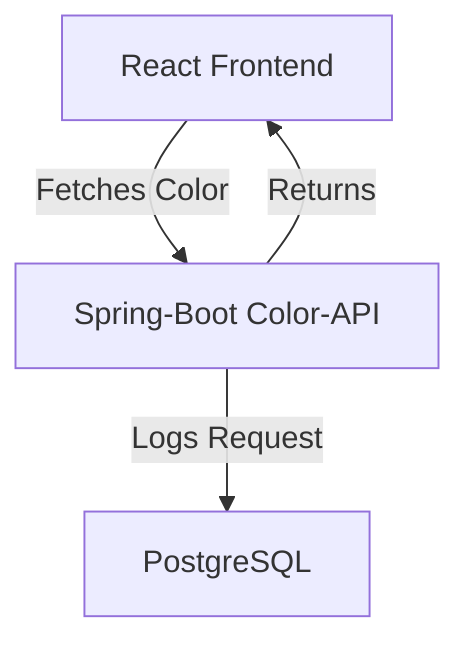
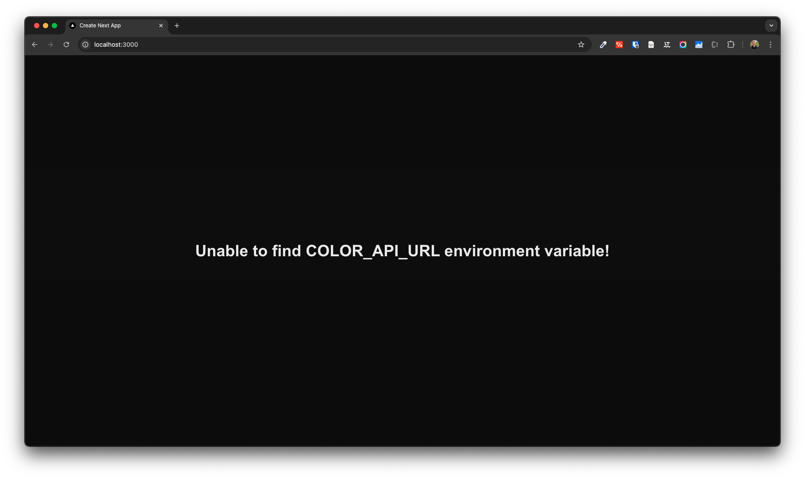
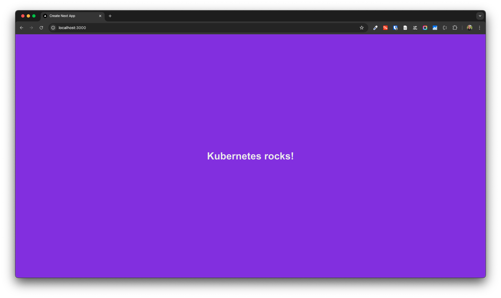

# Kubernetes for Developers Workshop 🚀

> [!CAUTION]
> All material provides **only an introduction** to containerization & K8s.
> It is not intended for production use and does not cover all best practices.
> Please dig especially into security topics before deploying anything to production.

This workshop is intended for developers who want to learn how to deploy applications to Kubernetes.

<!-- TABLE OF CONTENTS -->
<details>
  <summary>Table of Contents</summary>
  <ol>
    <li>
      <a href="#prerequisites">Prerequisites</a>
    </li>
    <li>
      <a href="#color-application-architecture-overview">Color-Application Architecture Overview</a>
    </li>
    <li><a href="#section-1-containerize-the-application">Section 1 Containerize the Application</a>
      <ul>
        <li><a href="#part-11-understanding-containers">Part 1.1 Understanding Containers</a></li>
        <ul>
          <li><a href="#part-111-understanding-multi-stage-builds-optional">Part 1.1.1 Understanding Multi-Stage Builds (Optional)</a></li>
        </ul>
        <li><a href="#part-12-build-and-run-the-frontend-application-container">Part 1.2 Build and Run the Frontend Application Container</a></li>
        <li><a href="#part-13-connecting-containers-using-docker-compose">Part 1.3 Connecting Containers Using docker-compose</a></li>
      </ul>
    <li><a href="#section-2-kubernetes-deployment">Section 2 Kubernetes Deployment</a></li>
      <ul>
        <li><a href="#part-21-installing-and-starting-minikube">Part 2.1 Installing and Starting Minikube</a></li>
        <li><a href="#part-22-create-the-workshop-namespace-in-minikube">Part 2.2 Create the "workshop" Namespace in Minikube</a></li>
        <li><a href="#part-23-postgresql-installation-using-helm">Part 2.3 PostgreSQL Installation Using Helm</a></li>
        <li><a href="#part-24-creating-kubernetes-deployment-files">Part 2.4 Creating Kubernetes Deployment Files</a></li>
        <li><a href="#part-25-deploy-the-entire-application">Part 2.5 Deploy the Entire Application</a></li>
      </ul>
    </li>
    <li><a href="#section-3-helm-charts">Section 3: Helm Charts</a></li>
      <ul>
        <li><a href="#part-31-create-a-helm-chart-for-the-color-api">Part 3.1 Create a Helm Chart for the color-api</a></li>
        <li><a href="#part-32-configure-helm-values-for-replicas">Part 3.2 Configure Helm Values for Replicas</a></li>
        <li><a href="#part-33-package-the-helm-chart">Part 3.3 Package the Helm Chart</a></li>
      </ul>
  </ol>
</details>

## Prerequisites
- Install [Homebrew](https://brew.sh/)
- Docker or Podman
- [Minikube](https://minikube.sigs.k8s.io/docs/start/)
- [kubectl](https://kubernetes.io/docs/tasks/tools/install-kubectl-linux/#install-kubectl-binary-with-curl-on-linux)
- [Helm](https://helm.sh/docs/intro/install/)

## Color-Application Architecture Overview



## Section 1 Containerize the Application

### Part 1.1 Understanding Containers

1. Explore the example Spring Boot application in the [color-api](color-api) directory. It provides an endpoint that returns a random hex color.
2. Review the [Dockerfile](color-api/Dockerfile).
3. Build the container image with the following command:
    ```bash
    docker build -t spring-boot-demo:latest color-api
    ```
4. Inspect the image, which is essentially a tar archive:
    ```bash
    docker save spring-boot-demo:latest -o spring-boot-demo.tar
    ```
5. Run the `inspect_layers.sh` script:
   - It extracts the tar archive into the [extracted_image](extracted_image) folder.
   - It extracts each layer tar archive in the [extracted_image/blobs](extracted_image/blobs) folder into the [layers](layers) folder.
   - It merges the layers into a single file system in the [merged_layers](merged_layers) folder, resolving conflicts by replacing files as needed.

6. Examine the [merged_layers](merged_layers) folder to see the file system of the container image.

#### Part 1.1.1 Understanding Multi-Stage Builds (Optional)

7. Modify the Dockerfile as instructed in the comments to create a multi-stage build. Rebuild and inspect the image again.

### Part 1.2 Build and Run the Frontend Application Container

1. Explore the example Next.js application in the [nextjs-frontend](nextjs-frontend) directory. It fetches the randomly generated color from the color-api and displays it.
2. Build and run the container:
    ```bash
    docker build -t nextjs-frontend:latest nextjs-frontend
    docker run -p 3000:3000 nextjs-frontend:latest
    ```
3. Open [http://localhost:3000](http://localhost:3000) in your browser.



### Part 1.3 Connecting Containers Using docker-compose

1. Review the [docker-compose.yaml](docker-compose.yaml) file.
2. Note that it adds PostgreSQL to the deployment and configures the `COLOR_API_URL` environment variable.
3. Build and start the containers using the following command. Use the image references from GitHub to avoid building the images yourself:
    ```bash
    docker compose up
    ```
4. Open [http://localhost:3000](http://localhost:3000) in your browser. It should now return a color from the color-api.



## Section 2 Kubernetes Deployment

### Part 2.1 Installing and Starting Minikube

Follow the instructions at [Minikube Start](https://minikube.sigs.k8s.io/docs/start/).

```bash
brew install minikube && minikube start
```

Enable the storage provisioner and ingress controller:

```bash
minikube addons enable storage-provisioner
minikube addons enable ingress
```

### Part 2.2 Create the "workshop" Namespace in Minikube

Set the kubectl alias to the Minikube cluster:

```bash
alias kubectl="minikube kubectl --"
```

Create the namespace:

```bash
kubectl create namespace workshop
```

Alternatively, install `kubectl` by following the [official documentation](https://kubernetes.io/docs/tasks/tools/install-kubectl-linux/#install-kubectl-binary-with-curl-on-linux).

### Part 2.3 PostgreSQL Installation Using Helm

Add the Bitnami repository:

```bash
helm repo add bitnami https://charts.bitnami.com/bitnami
```

Install PostgreSQL:

```bash
helm install -n workshop postgresql bitnami/postgresql
# or
helm install postgresql -n workshop oci://registry-1.docker.io/bitnamicharts/postgresql
```

Inspect the running deployment to ensure it started successfully:

```bash
kubectl get pods -n workshop

NAME                        READY   STATUS    RESTARTS       AGE
postgresql-0                1/1     Running   1 (2m5s ago)   15m
```

### Part 2.4 Creating Kubernetes Deployment Files

- Deploy the COLOR-API

    The Next.js frontend deployment files are already provided as an example in the [kube/nextjs-frontend](kube/nextjs-frontend) directory.
    ```bash
    kubectl apply -n workshop -f kube/nextjs-frontend
    ```

    Create the `color-api` deployment files and apply them to the cluster:

    ```bash
    kubectl apply -n workshop -f kube/color-api
    ```

    Hints:
    - You need a deployment and a service.
    - Use the image `ghcr.io/l3montree-dev/kubernetes-developer-workshop/color-api:latest`.
    - The application runs on port 8080.
    - Required environment variables:
        - `DB_URL`: jdbc:postgresql://postgresql:5432/postgres
        - `DB_USER`: postgres
        - `DB_PASS`: ? (check the secret created by the PostgreSQL Helm chart)

- Configure the connection between the frontend and the color-api using the `COLOR_API_URL` environment variable.

### Part 2.5 Deploy the Entire Application

Kubernetes is idempotent, so you can apply the entire configuration:

```bash
kubectl apply -n workshop -R -f kube
```

Check the running pods:

```bash
kubectl get pods -n workshop

NAME                         READY   STATUS    RESTARTS      AGE
color-api-5c8bc7f9d6-2t7df   1/1     Running   0             23m
color-api-5c8bc7f9d6-72qnw   1/1     Running   0             23m
frontend-68bcf87ffd-n7wtp    1/1     Running   0             39m
postgresql-0                 1/1     Running   1 (49m ago)   63m
```

Use Minikube to view the frontend:

```bash
minikube tunnel
```

The frontend should be available at [http://127.0.0.1](http://127.0.0.1).

## Section 3: Helm Charts

### Part 3.1 Create a Helm Chart for the color-api

Create a new Helm chart:

```bash
helm create color-application
```

Remove everything except `Chart.yaml` and `values.yaml`:

```bash
rm -rf color-application/templates/* color-application/charts
```

Clear the `values.yaml` file:

```bash
echo "" > color-application/values.yaml
```

Copy the contents of the `kube` folder into the `templates` folder of the Helm chart:

```bash
cp -r kube/* color-application/templates/
```

Modify the `color-application/nextjs-frontend/ingress.yaml` file to use the path prefix `/helm`.

Install the Helm chart:

```bash
helm upgrade --install -n workshop-helm --create-namespace color-application color-application
```

Check the running pods in the `workshop-helm` namespace:

```bash
kubectl get pods -n workshop-helm

NAME                         READY   STATUS                       RESTARTS   AGE
color-api-564cf76456-nchc7   0/1     CreateContainerConfigError   0          9m56s
color-api-564cf76456-w2dkr   0/1     CreateContainerConfigError   0          9m56s
frontend-68bcf87ffd-6pkz9    1/1     Running                      0          9m56s
```

The color-api pods are not starting because the database is missing. Add the PostgreSQL dependency to `Chart.yaml`:

```yaml
dependencies:
  - name: postgresql
    version: 16.4.9
    repository: https://charts.bitnami.com/bitnami
```

Install the Helm chart again:

```bash
helm upgrade --install -n workshop-helm --create-namespace color-application color-application
```

If it fails, install the dependencies first:

```bash
helm dependency update color-application
```

Apply the Helm chart again:

```bash
helm upgrade --install -n workshop-helm --create-namespace color-application color-application
```

Check the running pods:

```bash
kubectl get pods -n workshop-helm

NAME                             READY   STATUS                       RESTARTS   AGE
color-api-564cf76456-khh2s       0/1     CreateContainerConfigError   0          52s
color-api-564cf76456-w2dkr       0/1     CreateContainerConfigError   0          16m
color-application-postgresql-0   1/1     Running                      0          108s
frontend-68bcf87ffd-6pkz9        1/1     Running                      0          16m
```

The color-api pods are still not starting. Configure the environment variables correctly:

```yaml
env:
  - name: DB_PASS
    valueFrom:
      secretKeyRef:
        name: color-application-postgresql
        key: postgres-password
```

Check if the `DB_URL` is correctly configured. Find the service name with:

```bash
kubectl get services -n workshop-helm
```

Apply the Helm chart again:

```bash
helm upgrade --install -n workshop-helm --create-namespace color-application color-application
```

Check the running pods and visit the frontend.

### Part 3.2 Configure Helm Values for Replicas

Set the number of replicas in `values.yaml`:

```yaml
# values.yaml
replicaCount: 2
```

Use the `replicaCount` value in the `color-application/color-api/deployment.yaml`:

```yaml
spec:
  replicas: {{ .Values.replicaCount }}
```

Apply the Helm chart again:

```bash
helm upgrade --install -n workshop-helm --create-namespace color-application color-application
```

Check the running pods:

```bash
kubectl get pods -n workshop-helm

NAME                             READY   STATUS    RESTARTS   AGE
color-api-86f8b7bb7d-29mt7       1/1     Running   0          8m48s
color-api-86f8b7bb7d-2lzql       1/1     Running   0          8m46s
color-api-86f8b7bb7d-rl78x       1/1     Running   0          15s
color-application-postgresql-0   1/1     Running   0          10m
frontend-68bcf87ffd-vvv5v        1/1     Running   0          10m
```

Visit the frontend. You should see three different colors after reloading a few times.

### Part 3.3 Package the Helm Chart

Package the Helm chart:

```bash
helm package color-application
```

The packaged Helm chart is in the `color-application-0.1.0.tgz` file. Install the packaged Helm chart:

```bash
helm install -n workshop-helm-packaged --create-namespace color-application color-application-0.1.0.tgz --set replicaCount=1
```

The installation fails due to a conflicting path in the ingress. Maybe this can be made configurable as well?


## Miscellaneous

### Building and Publishing Docker Images

Build and push the Docker images:

```bash
docker buildx build --push --platform linux/arm64/v8,linux/amd64 -t ghcr.io/l3montree-dev/kubernetes-developer-workshop/nextjs-frontend:latest nextjs-frontend
```

```bash
docker buildx build --push --platform linux/arm64/v8,linux/amd64 -t ghcr.io/l3montree-dev/kubernetes-developer-workshop/color-api:latest color-api
```
